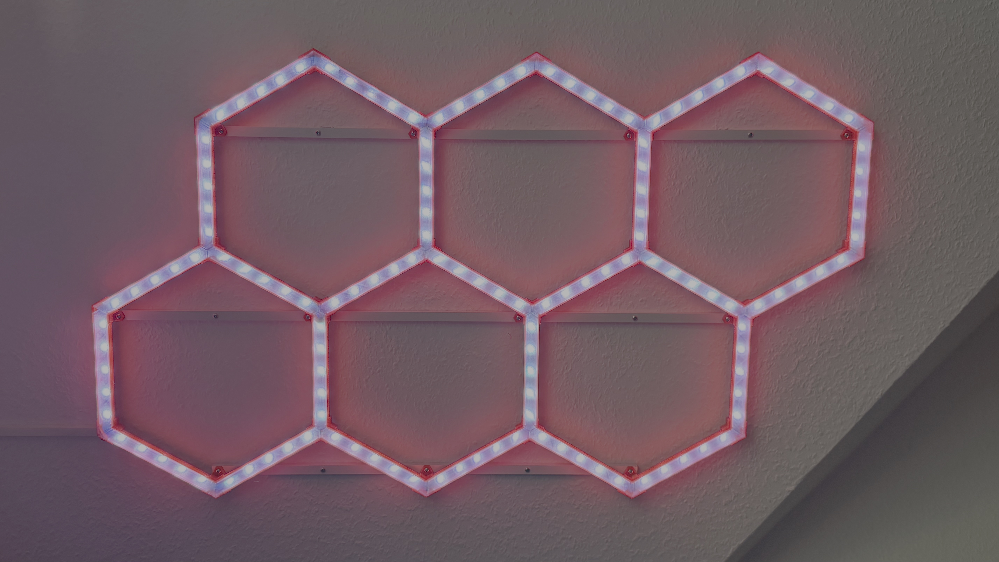

# WLED Hexagon Project

*[English version](README.md)*



6 druckbare LED-Hexagone (Design: [Hexagon LED Lamp von NickiDotDK, Printables](https://www.printables.com/model/1063657), CC BY-NC 4.0), angesteuert über WLED auf ESP32 mit WS2801-Strips und eigener PCB.

**→ Vollständige Bauanleitung inkl. Video: [BUILD_GUIDE.md](BUILD_GUIDE.md)**

## Hardware-Übersicht

| Komponente | Wert/Typ |
|---|---|
| MCU | ESP32-WROOM-32, 30-Pin Devboard |
| LEDs | WS2801, 135 LEDs gesamt, 6 Hexagone |
| Netzteil | 5 V / 10 A |
| Level-Buffer | IC1: SN74AHCT125N |
| Data Pin (ESP32) | GPIO 23 |
| Clock Pin (ESP32) | GPIO 18 |

Details, BOM und Verdrahtung: [`docs/hardware.md`](docs/hardware.md) · WLED-Konfiguration: [`docs/wled-config.md`](docs/wled-config.md)

## Repo-Struktur

```
WLED_Hexagone_Project/
├── README.md
├── BUILD_GUIDE.md
├── LICENSE.md                   # CC BY-NC-SA 4.0 für Board/Gehäuse/Firmware-Config
├── .gitignore
├── docs/
│   ├── hardware.md              # BOM, Pinbelegung, Verdrahtung
│   ├── wled-config.md           # WLED-Setup, verifizierte Konfig-Werte, LED-Mapping
│   └── media/
│       ├── hexagon-lamp-photo.jpg
│       ├── clip.mov
│       └── ledmap-reference-jakepeters.png
├── hardware/
│   ├── pcb/
│   │   ├── schaltplan.pdf
│   │   ├── ESP32_WLED_WS2801.step
│   │   ├── BOM.txt
│   │   └── CAMOutputs/           # Gerber, Drill, Assembly (Fertigungsdaten)
│   └── enclosure/
│       ├── WLED_Case_5V10A_ESP32.step
│       ├── Top.3mf / Bottom.3mf / Clamp_in.3mf / Clamp_out.3mf
│       └── Top.stl / Bottom.stl / Clamp_in.stl / Clamp_out.stl
├── model-source/
│   ├── LICENSE-model.md         # CC BY-NC 4.0 Hinweis zum Hexagon-STL/STEP-Modell
│   └── hexagon-led-lamp.pdf     # Original-Produktseite (Printables-Export)
└── firmware/
    ├── ledmap.json
    ├── wled_cfg_WLED.json
    └── wled_presets_WLED.json
```

## WLED Fork

Dieses Projekt nutzt einen Fork von [wled/WLED](https://github.com/wled/WLED) (offizielles Upstream-Repo, MIT-Lizenz). Der Fork selbst gehört als **git submodule** oder **separates Repo** eingebunden — siehe [`docs/wled-config.md`](docs/wled-config.md) für die Empfehlung und den genauen Befehl.

## Lizenz

- Hexagon-3D-Modell: [NickiDotDK](https://www.printables.com/model/1063657), CC BY-NC 4.0 — siehe `model-source/LICENSE-model.md`
- Platine, Gehäuse, Firmware-Konfiguration dieses Projekts: **CC BY-NC-SA 4.0** — siehe [`LICENSE.md`](LICENSE.md). Kommerzieller Verkauf von Nachbauten ist damit ausgeschlossen; privater Nachbau und nicht-kommerzielle Weitergabe mit Namensnennung sind erwünscht.
